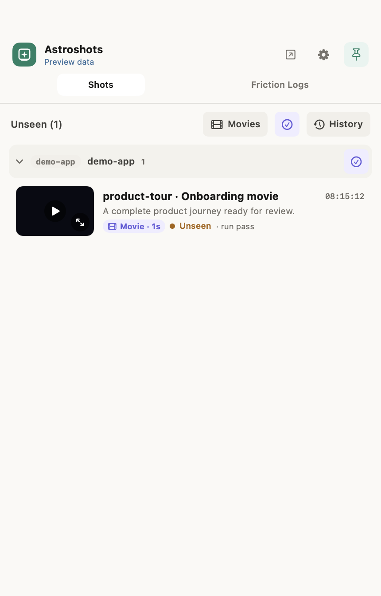
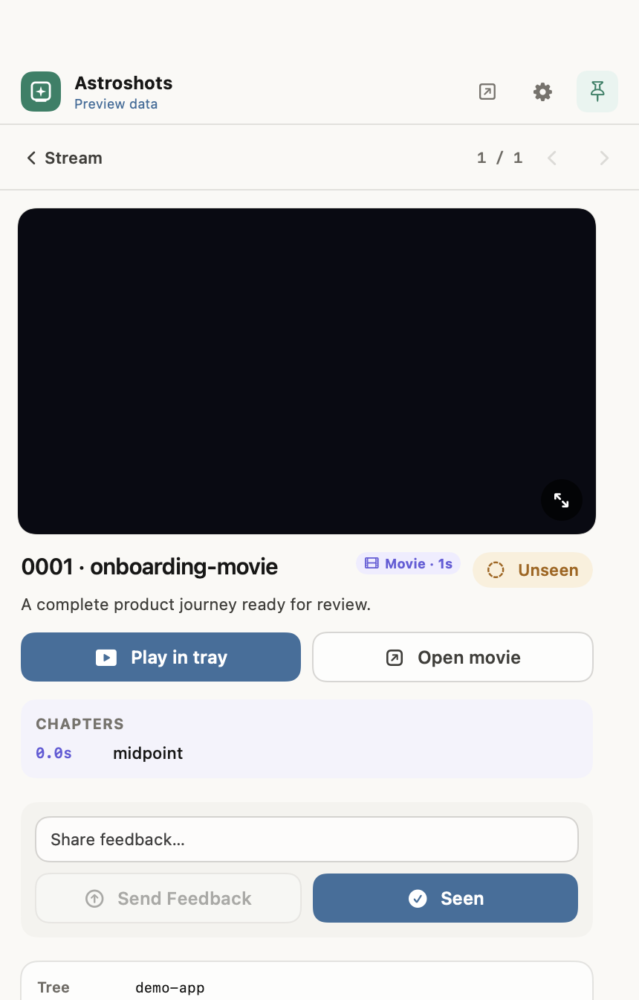
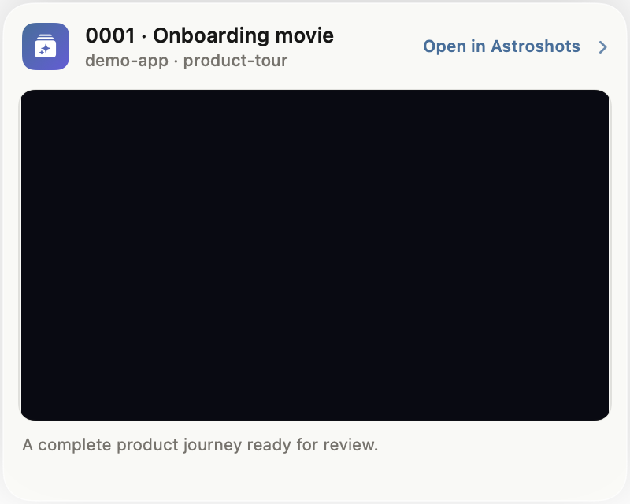
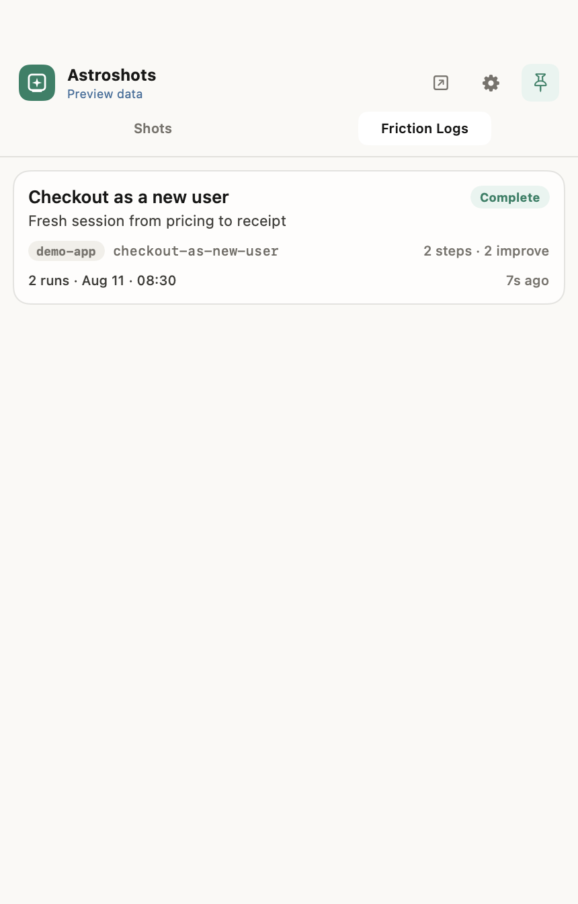
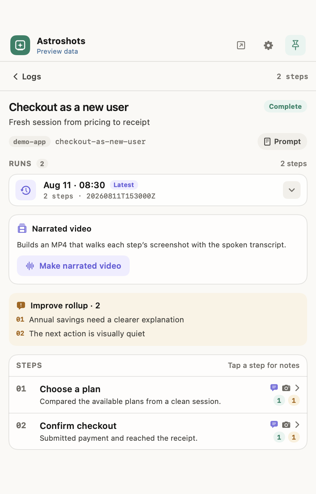
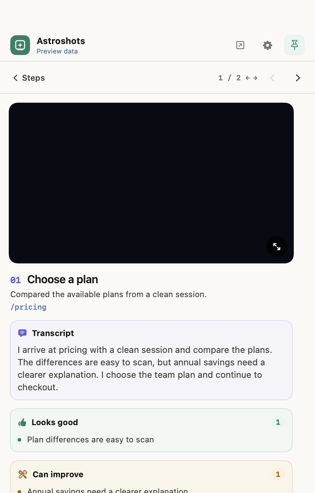

# Astroshots

**Watch screenshots, journey movies, and UX friction as they land.**

Astroshots is a local macOS review tray for browser tests, harness runs, and
agentic UX walkthroughs. Point your tools at a simple folder layout: stills and
movies stream into **Shots**, structured user journeys collect under **Friction
Logs**, and everything stays on disk across every project you watch.

<p align="center">
  
  &nbsp;
  
</p>

---

## Why Astroshots

| Problem | What Astroshots does |
|---------|----------------------|
| Screenshots and recordings buried in `/tmp` or CI artifacts | Live stream as soon as a still or movie lands |
| Jumping between projects to find shots | One tray, every project under your watched folders |
| “Did that step look right?” mid-run | Desktop overlay above all windows |
| Manual folder digging after a suite | Newest-first history with titles from a small manifest |
| UX findings scattered across chat and screenshots | Friction Logs pair every step with evidence, transcript, and good/improve notes |
| Repeating a walkthrough loses the earlier result | Per-scenario run history keeps every non-empty attempt switchable |

No project picker. No account. No cloud. Just files on disk and an Astroshots
icon in the menu bar.

<p align="center">
  
</p>

---

## Install

### Quickstart: app + skills

Prerequisites: **macOS 14+** and **Node.js 22.14+**.

1. Install the app and launch it:

   ```bash
   brew install --cask ArchAstro/tools/astroshots
   open -a Astroshots
   ```

   No DMG, no drag to Applications. Prefer a direct download, or hitting
   `No available cask` because the tap change has not merged yet? Use
   [App from a release](#app-from-a-release).
2. Choose the folder that contains your coding projects when first-launch setup
   asks what to watch. Add more later from the menu-bar icon → gear →
   **Add folders…**.
3. Install all six agent skills globally so they are available in every
   project:

   ```bash
   npx skills add ArchAstro/astroshots --skill '*' -g -y
   npx skills list -g
   ```

4. If you will capture browser-backed screenshots or movies, install the
   managed Chromium runtime once:

   ```bash
   npx astroshot install-browser
   ```

5. Verify the whole path from any project inside the folder selected in step 2 —
   one command, no assets of your own:

   ```bash
   cd /path/to/your/project
   npx astroshot demo
   ```

   `astroshot demo` writes real stills, a movie poster+video pair, and a
   `manifest.json` into `.astroshot/astroshot-demo/`. It needs no Chromium and
   works even with the app closed. Open the Astroshots menu-bar icon →
   **Shots**: an **astroshot-demo** entry with a movie badge confirms the app
   and the on-disk contract are connected.

6. If nothing appears — or before filing a bug — diagnose it in one line:

   ```bash
   npx astroshot doctor
   ```

   `doctor` reports Node version, whether this project is inside a folder
   Astroshots actually watches, whether the app is installed and running,
   whether the managed Chromium runtime is present, and macOS Screen Recording
   state — each failing line carries the exact command that fixes it. It exits
   non-zero when a required check fails, and it never installs anything or
   changes app state.

The sections below cover project-local or individual skill installs, capture
modes, movies, friction logs, and the complete file contract.

### App with Homebrew (recommended)

```bash
brew install --cask ArchAstro/tools/astroshots
open -a Astroshots
```

The cask installs the same Developer ID signed and notarized build into
`/Applications`, straight from the release DMG. It declares `auto_updates true`,
so Sparkle keeps handling updates and Homebrew does not fight the app's own
self-update. To remove it: `brew uninstall --cask astroshots` (add
`--zap` to also delete preferences and caches).

> **Requires the cask to be merged in the tap.** `Casks/astroshots.rb` lives in
> [ArchAstro/homebrew-tools](https://github.com/ArchAstro/homebrew-tools), a
> separate repository. Until that change merges, `brew install --cask` reports
> `No available cask` — use [App from a release](#app-from-a-release) in the
> meantime. Verify with `brew info --cask ArchAstro/tools/astroshots`. The exact
> files and steps to land it are in
> [`docs/plans/2026-08-17-homebrew-cask-tap-changes.md`](docs/plans/2026-08-17-homebrew-cask-tap-changes.md).

After first launch:

1. Astroshots lives in the **menu bar** (no Dock icon). There is **no default watch folder**: first launch **asks which folders to watch** (the open panel starts in `~/Projects` when that folder exists).
2. After setup it **warms from a local index** of known `.astroshot` folders and replays newer filesystem events, avoiding another full workspace walk.
3. Click the Astroshots icon → gear → **Add folders…** to watch more locations later.
4. **Right-click** the Astroshots icon → **Quit Astroshots** to exit (left-click opens the tray).

### App from a release

Prefer a direct download, or not using Homebrew?

1. Download the latest versioned **Astroshots-x.y.z.dmg** from [Releases](https://github.com/ArchAstro/astroshots/releases).
2. Open the DMG and drag **Astroshots** into **Applications**.
3. Launch Astroshots and follow the same first-launch steps as above.

Builds are Developer ID signed and notarized so Gatekeeper accepts a normal open.
Installed copies can **Check for Updates…** (Sparkle) against the latest GitHub
Release appcast, however they were installed.

### App from source

macOS 14+, Xcode 26+, [XcodeGen](https://github.com/yonaskolb/XcodeGen) (`brew install xcodegen`).

```bash
git clone https://github.com/ArchAstro/astroshots.git
cd astroshots/macos
./scripts/bootstrap.sh
open Astroshots.xcodeproj   # ⌘R
```

Details: [`macos/README.md`](macos/README.md).

---

## How it works

1. **Watch** — On first launch you choose one or more folders; Astroshots recursively watches them for `.astroshot/` trees.
2. **Write** — A harness, agent, or script writes stills, movie poster+video
   pairs, and optional execution metadata under `.astroshot/`.
3. **See** — New review frames flash as desktop overlays. **Shots** combines
   stills and movies across worktrees; the Movies filter isolates recordings.
4. **Play** — Movie detail and full-screen review play WebM, MP4, and MOV with
   scrubbing, volume, full-screen controls, duration/source metadata, and chapters.
5. **Review** — Send feedback or mark the current poster/image Seen.
   Astroshots writes hash- and run-scoped human state to `review.json`.
6. **Walk the product** — **Friction Logs** lists agentic scenarios under the
   reserved `.astroshot/friction-logs/` tree. Each run keeps ordered steps,
   screenshots, a spoken transcript, Looks good / Can improve notes, and an
   improvement rollup. Run history stays switchable.
7. **Narrate (optional)** — On Apple Silicon, enable Settings → Narration to
   generate an on-device MP4 from step screenshots and transcripts with
   Qwen3-TTS. Models download only after opt-in.

### Movies in Shots

<p align="center">
  
  &nbsp;
  
</p>

### Friction Logs

<p align="center">
  
  &nbsp;
  
  &nbsp;
  
</p>

Every README image above comes from the current native Debug app and a
synthetic local fixture. Inventory: [`docs/screenshots.json`](docs/screenshots.json).
Regenerate the complete set with:

```bash
bash scripts/capture-readme-screenshots.sh
```

### Write layout

```text
<project>/.astroshot/<feature>/
  manifest.json          # optional execution state, written by the harness
  review.json            # optional human feedback, written by Astroshots
  0001-signed-in.png
  0002-configure.png
  0003-onboarding.png     # movie poster shown in the stream/overlay
  0003-onboarding.webm    # movie played by Astroshots
```

Example `manifest.json`:

```json
{
  "version": 1,
  "feature": "install-wizard",
  "run_id": "install-wizard-…",
  "status": "running",
  "shots": [
    {
      "id": "0002",
      "file": "0002-configure.png",
      "slug": "configure",
      "title": "Configure",
      "description": "Configuration screen for the resource.",
      "url": "/solutions · dialog"
    }
  ]
}
```

Project name is inferred from the folder that contains `.astroshot`. Feature is the directory name under it.

Movie entries extend the same manifest shot shape; `file` remains the poster
used by the stream and review state:

```json
{
  "kind": "movie",
  "file": "0003-onboarding.png",
  "video": "0003-onboarding.webm",
  "duration_ms": 4200,
  "source": "browser",
  "chapters": [
    { "slug": "signed-in", "t_ms": 900 },
    { "slug": "configured", "t_ms": 2800 }
  ]
}
```

`manifest.json.status` reports only whether the capture journey is running,
passed, or failed. It is never a human acknowledgement. Seen state and feedback
live separately in `review.json`, keyed by the exact image filename:

```json
{
  "version": 1,
  "run_id": "install-wizard-…",
  "updated_at": "2026-07-26T17:42:00Z",
  "reviews": {
    "0002-configure.png": {
      "decision": "seen",
      "reviewed_at": "2026-07-26T17:42:00Z",
      "image_sha256": "a3b1a3b1a3b1a3b1a3b1a3b1a3b1a3b1a3b1a3b1a3b1a3b1a3b1a3b1a3b1a3b1",
      "comments": [
        {
          "id": "A1B2C3D4-E5F6-47A8-9000-111122223333",
          "body": "The primary action is clipped at this width.",
          "created_at": "2026-07-26T17:41:32Z"
        }
      ]
    }
  }
}
```

An absent decision means unseen; comment-only entries may also omit
`reviewed_at` and `image_sha256`. `seen` applies only while `image_sha256`
matches the current file bytes. Replacing an image at the same path makes it
unseen again; existing comments remain readable so an agent can act on them.
Agents must not infer Seen from `manifest.json`, manufacture an
acknowledgement, or rewrite human feedback.

Feedback is scoped to `run_id`. When the manifest has a run id, a missing or
different `review.json.run_id` makes the current run unseen; the prior run's
acknowledgement and comments do not carry forward, even when the bytes match.

### Reading Astroshots' own settings

A tool that needs to know **which folders Astroshots watches** must read the
app's preferences domain, and must read both watch-root keys in the right order
— reading only the current key silently reports "not configured" for an upgraded
install, and guessing the wrong domain prefix fails the same silent way. The
canonical domain and the full read contract are in
[`docs/PREFERENCES.md`](docs/PREFERENCES.md), enforced by
[`scripts/verify-preferences-contract.mjs`](scripts/verify-preferences-contract.mjs).

---

## Friction-log layout

`friction-logs` is a reserved namespace, not a Shots feature. Scenario prompts
and every non-empty attempt stay together:

```text
<project>/.astroshot/friction-logs/checkout-as-new-user/
  prompt.md
  meta.json
  runs/20260811T153000Z/
    log.jsonl
    0001-choose-plan.png
    0002-confirm-checkout.png
  runs/20260810T180000Z/
    log.jsonl
    0001-choose-plan.png
```

Each `log.jsonl` line is one user-visible step:

```json
{
  "step": 1,
  "id": "choose-plan",
  "title": "Choose a plan",
  "description": "Compared plans from a clean session.",
  "transcript": "I arrive at pricing and compare the plans. The differences are easy to scan, but annual savings need a clearer explanation. I choose the team plan and continue to checkout.",
  "screenshots": ["0001-choose-plan.png"],
  "good": ["Plan differences are easy to scan"],
  "improve": ["Annual savings need a clearer explanation"],
  "url": "/pricing"
}
```

New runs require a short spoken `transcript` per step. Read all transcripts in
order and they should form one continuous narration: action taken, what worked,
what did not, and a transition into the next step. The tray loads every
non-empty run newest-first, hides empty stubs, rolls up improvements, and lets
the reviewer switch runs and step through evidence with ← →.

Install/use the **friction-log** skill to author, list, or execute this contract.
Astroshots can derive a narrated MP4 after the run; agents still write the
screenshots and transcripts, not TTS output.

---

## Capture tools

Astroshots publishes one fixture-driven CLI for deterministic React, Ink, and
PTY stills plus source-aware journey movies. Install it as
[`astroshot`](packages/astroshot-unscoped), the unscoped package, which needs no
registry configuration:

| Mode | Use it for | Command |
|------|------------|---------|
| `react` | React components, dialogs, forms, and other isolated UI states | `astroshot react <fixture> -o <image>` |
| `ink` | Ink terminal components rendered through a real terminal model | `astroshot ink <fixture> -o <image>` |
| `pty` | Arbitrary terminal executables such as Ratatui, Bubble Tea, or curses | `astroshot pty <fixture> -o <image>` |
| `movie` | Browser, truecolor PTY, native macOS window, or custom-frame journeys | `astroshot movie run --source <source> …` |

Generate a typed or declarative starting fixture with `astroshot init react`,
`astroshot init ink`, or `astroshot init pty`. Existing files are preserved
unless `--force` is explicit. The former `tui` command remains an alias for
`ink`.

**Two package names, one CLI.** `astroshot` is the recommended install: it
bundles [`@archastro/astroshot`](packages/astroshot) and the three capture
engines inside its own tarball, so it installs with no registry flags even when
your `~/.npmrc` maps the `@archastro` scope to a private registry. The scoped
packages remain published and fully supported — use them directly if you already
resolve `@archastro` from the public registry. See
[`docs/UNSCOPED-CLI-DESIGN.md`](docs/UNSCOPED-CLI-DESIGN.md).

Install Chromium once for the browser-backed modes:

```bash
npx astroshot install-browser
```

On Linux CI images that also need Chromium's system libraries, add
`--with-deps`.

Capture a React fixture:

```bash
npx astroshot react ./fixtures/account-dialog.tsx \
  -o ./screenshots/account-dialog.png
```

Capture an Ink fixture:

```bash
npm install --save-dev ink@^7.1 react@^19
npx astroshot ink ./fixtures/install-wizard.tsx \
  -o ./screenshots/install-wizard.png
```

Capture a real Ratatui or other terminal executable through a pseudoterminal:

```bash
npx astroshot pty ./fixtures/ratatui.yaml \
  -o ./screenshots/ratatui.png
```

React and Ink modes also accept `batch <manifest.yaml|json>`. Their fixture
APIs, PTY action contract, configuration, and manifest formats are documented
in the package READMEs.
Use a component tool when fixed props can express the state. Use a browser
journey when the capture must prove routing, authentication, live data, or
the complete application shell.

### Record a journey movie

Ask the CLI to choose the correct pixel source before recording:

```bash
astroshot movie which-source "record a Ratatui dashboard with truecolor"
astroshot movie --help
```

| Journey | `--source` | Why |
|---------|------------|-----|
| Web / SPA / Playwright | `browser` | Records the browser directly; no desktop Chrome grab |
| TUI / CLI / truecolor | `pty` | Preserves terminal color without recording Terminal.app |
| Native macOS app | `desktop.window` | Targets AppKit/SwiftUI chrome through the shipped macOS window tooling |
| Custom PNG sequence | `frames` | Encodes caller-owned pixels into the shared sink |

```bash
# Browser
astroshot movie run --source browser --feature checkout --slug purchase \
  --url https://example.com/checkout

# Native macOS window (requires Screen Recording permission)
astroshot movie list-windows
astroshot movie run --source desktop.window --feature desktop-onboarding \
  --slug first-run --bundle-id com.example.App --duration-ms 4000
```

Every source writes a poster PNG, WebM/MP4 video, duration, source, and optional
chapters into the normal `.astroshot/<feature>/` manifest. Astroshots shows the
poster in the stream and overlay, then plays the video in tray or full-screen
review. `desktop.window` is macOS-only and rejects off-screen or nearly blank
captures unless `--allow-blank` is explicit.

Fixtures and configuration are executable code with the current user's
permissions. Only capture trusted repositories and review downloaded fixtures
or pull-request changes before running them.

To make a generated image appear in the Astroshots app, feed it to the capture
helper:

```bash
npx astroshot react ./fixtures/account-dialog.tsx \
  -o /tmp/account-dialog.png

./bin/astroshot-capture \
  --feature account-settings \
  --slug account-dialog \
  --title "Account dialog" \
  --description "The editable account fields are visible." \
  --source /tmp/account-dialog.png
```

The npm CLI runs independently of the macOS viewer. CI verifies the still modes
and cross-platform movie sources on Linux with the minimum supported Node.js
release and Node.js 24 LTS; `desktop.window` and the live viewer remain macOS
features.

---

## Live stream capture helper

Ship screenshots into the layout without hand-editing manifests:

```bash
# From a clone of this repo
export PATH="$PWD/bin:$PATH"

astroshot-capture --feature install-wizard --slug configure \
  --title "Configure" \
  --description "Configuration screen visible." \
  --source ./shot.png

astroshot-capture --feature install-wizard --status pass --finalize
```

That finalizes capture execution only. It does not mark any screenshot Seen.
Human acknowledgement and feedback are persisted by Astroshots in
`review.json`.

Or capture from an `agent-browser` CLI session:

```bash
astroshot-capture --feature install-wizard --slug configure \
  --from-agent-browser "$SESSION"
```

The helper lives at [`bin/astroshot-capture`](bin/astroshot-capture) →
[`skills/astroshots-review/scripts/astroshot-capture`](skills/astroshots-review/scripts/astroshot-capture).

### Agent skills

This repo ships **six** skills. Install them with the [skills](https://github.com/vercel-labs/skills) CLI.

| Skill | What it teaches |
|-------|-----------------|
| **astroshots-review** | Stream stills/movies under `.astroshot/` and read human feedback |
| **screenshot** | Plan, generate, review, and maintain documentation image sets |
| **astroshot** | Capture deterministic React, Ink, and PTY stills plus journey movies |
| **agent-browser** | Install & drive the agent-browser CLI |
| **browser-ui-harness** | Bash UI smoke harness design (runner vs cases, evidence, cleanup) |
| **friction-log** | Author, list, and run user-perspective UX scenarios with transcripts and evidence |

#### Install all skills (recommended)

**Global** (user-level, every project):

```bash
npx skills add ArchAstro/astroshots --skill '*' -g -y
```

**This git project only** (from that project’s root — no `-g`):

```bash
cd /path/to/your/project
npx skills add ArchAstro/astroshots --skill '*' -y
```

`--skill '*'` installs **every** skill in this repo (`astroshot`,
`astroshots-review`, `screenshot`, `agent-browser`, `browser-ui-harness`, and
`friction-log`). Using a single name (for example,
`--skill astroshots-review`) installs just that one.

#### Install one skill

```bash
# Global
npx skills add ArchAstro/astroshots --skill astroshots-review -g -y
npx skills add ArchAstro/astroshots --skill screenshot -g -y
npx skills add ArchAstro/astroshots --skill astroshot -g -y
npx skills add ArchAstro/astroshots --skill agent-browser -g -y
npx skills add ArchAstro/astroshots --skill browser-ui-harness -g -y
npx skills add ArchAstro/astroshots --skill friction-log -g -y

# This project only (from project root)
npx skills add ArchAstro/astroshots --skill agent-browser -y
```

#### Agents, list, update

```bash
# Limit which coding agents receive the skills
npx skills add ArchAstro/astroshots --skill '*' -g -y -a claude-code -a cursor -a codex
npx skills add ArchAstro/astroshots --skill '*' -g -y -a '*'

# See what’s in the package without installing
npx skills add ArchAstro/astroshots -l

# What’s installed
npx skills list -g          # global
npx skills list             # this project

# Update
npx skills update -g -y     # global
npx skills update -y        # this project
```

Skill sources: [`skills/`](skills/).

---

## Product tour

| Surface | Job |
|---------|-----|
| **Desktop overlay** | New frame above all windows; Open / dismiss |
| **Shots stream** | Newest-first stills and movies, worktree grouping, Unseen/History, Movies filter |
| **Movie detail** | Playback, chapters, duration/source metadata, feedback, Seen state |
| **Friction Logs** | Scenario prompts, run history, improvement rollup, step screenshots/transcripts/notes |
| **Narrated video** | Optional on-device transcript-to-MP4 generation on Apple Silicon |
| **Settings** | Watched folders, overlay behavior, narration, and software updates |

---

## Releases

User-facing notes live in [`CHANGELOG.md`](CHANGELOG.md) (Keep a Changelog).
macOS app and npm package versions are independent tracks
(`## [x.y.z] (macos)` vs `## [x.y.z] (npm)`).

| Maintainer action | What it does |
|-------------------|--------------|
| **Actions → Cut release** | Bump macOS marketing version + build, roll changelog, tag `vX.Y.Z`, **dispatch Release DMG**, PR to main |
| **Actions → Cut npm release** | Bump all four `@archastro/*` packages, roll changelog, tag `astroshot-vX.Y.Z`, **dispatch Publish npm package**, PR to main |
| [GitHub Releases](https://github.com/ArchAstro/astroshots/releases) | Signed DMG (macOS) and npm release notes |
| [ArchAstro/homebrew-tools](https://github.com/ArchAstro/homebrew-tools) | `Casks/astroshots.rb`, bumped automatically by **Release DMG** after the DMG is published |

Both cut workflows follow the same shape as `archastro-js` / `archastro-python`
`release.yml`: GITHUB_TOKEN tag pushes do not chain other workflows, so publish
is always dispatched explicitly.

```bash
# macOS app (patch/minor/major)
gh workflow run "Cut release" --repo ArchAstro/astroshots -f bump=patch

# npm packages
gh workflow run "Cut npm release" --repo ArchAstro/astroshots -f bump=patch
```

Before cutting either track, put notes under `## [Unreleased]` in
`CHANGELOG.md`. The cut workflow promotes that section into a dated release
header and leaves a fresh empty Unreleased block.

macOS signing secrets are documented in [`docs/SIGNING.md`](docs/SIGNING.md).
First-time npm bootstrap and trusted publishing are documented in
[`docs/GO-LIVE-CHECKLIST.md`](docs/GO-LIVE-CHECKLIST.md).

### One-time npm bootstrap

npm trusted publishing requires packages to exist before
`npm trust github` can authorize CI. Bootstrap once from a clean `main`, with
2FA, then configure trusted publishers for
`.github/workflows/publish-npm.yml` (see the go-live checklist). After that,
use **Cut npm release** only. Do not put an npm token in repository secrets.

The publish workflow is safe to retry after a partial npm release. It skips an
existing package version only when the registry tarball has the same integrity
as the package built from the tagged commit.

Tag `astroshot-vX.Y.Z` (or **Cut npm release**) starts
`.github/workflows/publish-npm.yml`. The
workflow rejects a tag unless every package has the same version, reruns
verification, publishes both still-image engines and the movie harness, then
publishes the unified CLI last through npm trusted publishing.

The workflow explicitly targets `https://registry.npmjs.org`. Trusted
publishing automatically attaches provenance after this repository and the
packages are public; npm does not generate provenance for a private source
repository.

---

## Requirements

- macOS 14 or later  
- One or more folders of projects to watch (configure in-app)
- Tools that can write stills or use `astroshot movie` (any language/harness may write the on-disk contract)

The npm screenshot tools require Node.js 22.14 or later and a locally installed
Chromium managed by Playwright.

Native-window movie capture needs macOS Screen Recording permission. Optional
narrated friction-log videos need Apple Silicon; enabling Narration downloads
the Qwen3-TTS model locally.

The canonical documentation and skill proof is
[`scripts/verify-skills.sh`](scripts/verify-skills.sh). CI runs its integration
mode, which captures React, Ink, and PTY images, streams them through
`astroshot-capture`, and asserts the resulting manifest. The separate
[`scripts/verify-packages.mjs`](scripts/verify-packages.mjs) proof packs all
four npm workspaces, installs the tarballs into a clean temporary npm project,
and executes the public still and movie `npx` commands.
[`scripts/verify-preferences-contract.mjs`](scripts/verify-preferences-contract.mjs)
guards the preferences domain and watch-root read contract documented in
[`docs/PREFERENCES.md`](docs/PREFERENCES.md).

---

## Contributing and security

See [`CONTRIBUTING.md`](CONTRIBUTING.md) for development and test commands.
Please report vulnerabilities privately as described in
[`SECURITY.md`](SECURITY.md). Astroshots and its npm packages are available
under the [MIT License](LICENSE).
