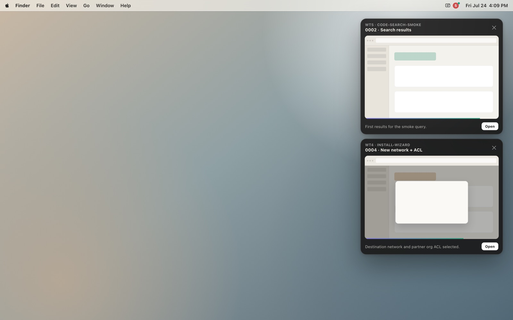
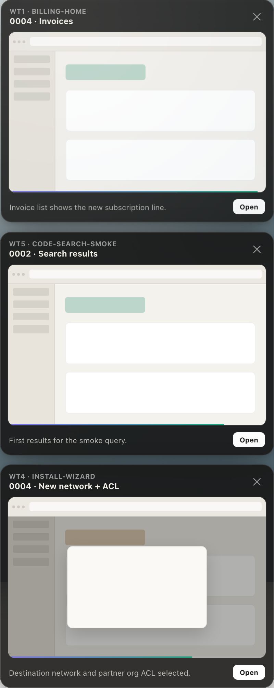
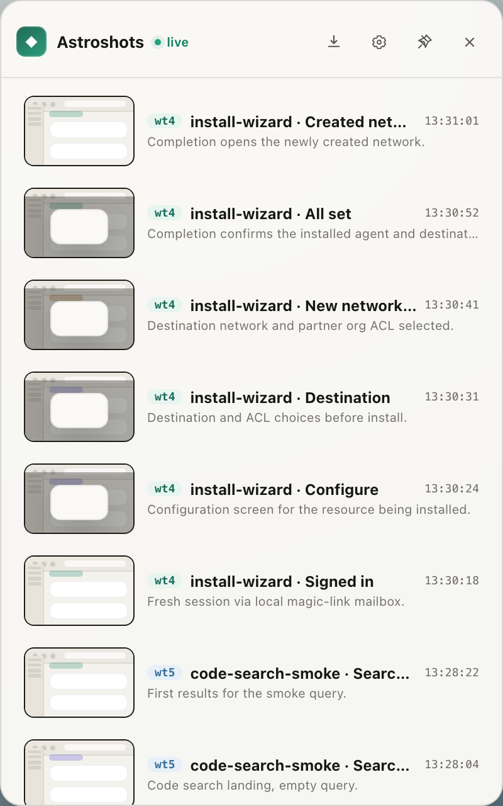
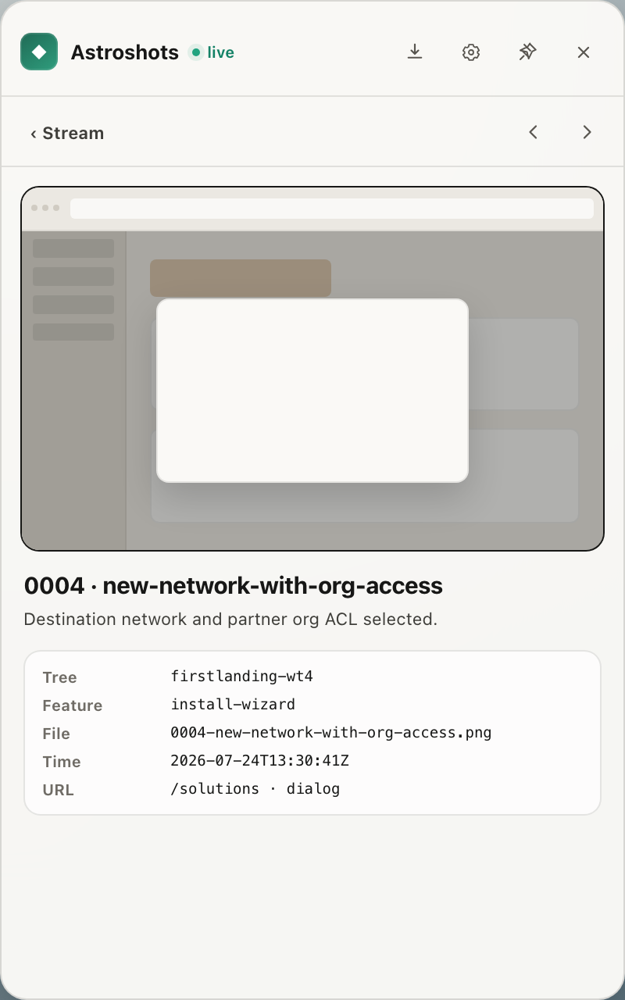
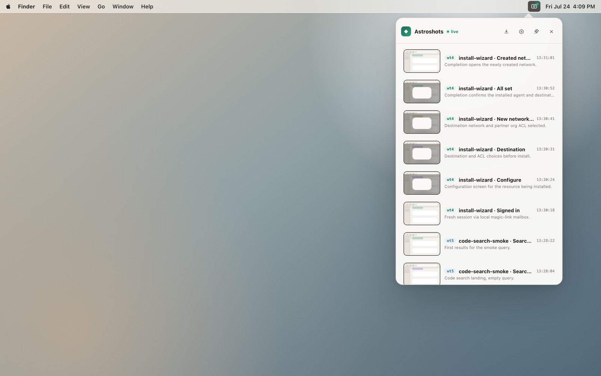

# Astroshots

**Watch your test screenshots as they land.**

Astroshots is a macOS menu-bar app for anyone who captures UI during browser tests, harness runs, or manual QA. Point your tools at a simple folder layout — frames stream in live, flash over your desktop, and stay in one history across every project you work in.

<p align="center">
  
</p>

---

## Why Astroshots

| Problem | What Astroshots does |
|---------|----------------------|
| Screenshots buried in `/tmp` or CI artifacts | Live stream as soon as a PNG is written |
| Jumping between projects to find shots | One tray, every project under your watched folders |
| “Did that step look right?” mid-run | Desktop overlay above all windows |
| Manual folder digging after a suite | Newest-first history with titles from a small manifest |

No project picker. No account. No cloud. Just files on disk and a camera icon in the menu bar.

<p align="center">
  
</p>

---

## Install

### From a release (recommended)

1. Download the latest **Astroshots.dmg** from [Releases](https://github.com/ArchAstro/astroshots/releases).
2. Open the DMG and drag **Astroshots** into **Applications**.
3. Launch Astroshots — it lives in the **menu bar** (no Dock icon). After the first run it **warms from a local index** of known `.astroshot` folders so the stream appears quickly, then finishes a full discovery walk in the background.
4. Click the camera icon → gear → add **watched folders** if you want locations beyond the default.
5. **Right-click** the camera icon → **Quit Astroshots** to exit (left-click opens the tray).

Builds are Developer ID signed and notarized so Gatekeeper accepts a normal open.

### From source

macOS 14+, Xcode 16+, [XcodeGen](https://github.com/yonaskolb/XcodeGen) (`brew install xcodegen`).

```bash
git clone https://github.com/ArchAstro/astroshots.git
cd astroshots/macos
./scripts/bootstrap.sh
open Astroshots.xcodeproj   # ⌘R
```

Details: [`macos/README.md`](macos/README.md).

---

## How it works

1. **Watch** — Astroshots recursively watches one or more folders you choose (default `~/archastro`) for `.astroshot/` trees.
2. **Write** — Your harness, agent, or script drops PNGs (and an optional
   execution `manifest.json`) under that layout.
3. **See** — New frames flash on the desktop; open the tray for the full
   stream. Click a row for detail.
4. **Review** — Click a screenshot for a chromeless, screen-sized review
   takeover. A human can send feedback or mark the current image Seen;
   Astroshots writes that state to `review.json` for agents and harnesses.

### The tray

<p align="center">
  
  &nbsp;
  
</p>

<p align="center">
  
</p>

### Write layout

```text
<project>/.astroshot/<feature>/
  manifest.json          # optional execution state, written by the harness
  review.json            # optional human feedback, written by Astroshots
  0001-signed-in.png
  0002-configure.png
```

Example `manifest.json`:

```json
{
  "version": 1,
  "feature": "install-wizard",
  "run_id": "install-wizard-…",
  "status": "running",
  "shots": [
    {
      "id": "0002",
      "file": "0002-configure.png",
      "slug": "configure",
      "title": "Configure",
      "description": "Configuration screen for the resource.",
      "url": "/solutions · dialog"
    }
  ]
}
```

Project name is inferred from the folder that contains `.astroshot`. Feature is the directory name under it.

`manifest.json.status` reports only whether the capture journey is running,
passed, or failed. It is never a human acknowledgement. Seen state and feedback
live separately in `review.json`, keyed by the exact image filename:

```json
{
  "version": 1,
  "run_id": "install-wizard-…",
  "updated_at": "2026-07-26T17:42:00Z",
  "reviews": {
    "0002-configure.png": {
      "decision": "seen",
      "reviewed_at": "2026-07-26T17:42:00Z",
      "image_sha256": "a3b1a3b1a3b1a3b1a3b1a3b1a3b1a3b1a3b1a3b1a3b1a3b1a3b1a3b1a3b1a3b1",
      "comments": [
        {
          "id": "A1B2C3D4-E5F6-47A8-9000-111122223333",
          "body": "The primary action is clipped at this width.",
          "created_at": "2026-07-26T17:41:32Z"
        }
      ]
    }
  }
}
```

An absent decision means unseen; comment-only entries may also omit
`reviewed_at` and `image_sha256`. `seen` applies only while `image_sha256`
matches the current file bytes. Replacing an image at the same path makes it
unseen again; existing comments remain readable so an agent can act on them.
Agents must not infer Seen from `manifest.json`, manufacture an
acknowledgement, or rewrite human feedback.

Feedback is scoped to `run_id`. When the manifest has a run id, a missing or
different `review.json.run_id` makes the current run unseen; the prior run's
acknowledgement and comments do not carry forward, even when the bytes match.

---

## Screenshot tools

Astroshots publishes one fixture-driven CLI,
[`@archastro/astroshot`](packages/astroshot), with React, Ink, and PTY modes.
It creates deterministic documentation and review images without requiring a
running application:

| Mode | Use it for | Command |
|------|------------|---------|
| `react` | React components, dialogs, forms, and other isolated UI states | `astroshot react <fixture> -o <image>` |
| `ink` | Ink terminal components rendered through a real terminal model | `astroshot ink <fixture> -o <image>` |
| `pty` | Arbitrary terminal executables such as Ratatui, Bubble Tea, or curses | `astroshot pty <fixture> -o <image>` |

Generate a typed or declarative starting fixture with `astroshot init react`,
`astroshot init ink`, or `astroshot init pty`. Existing files are preserved
unless `--force` is explicit. The former `tui` command remains an alias for
`ink`.

Install Chromium once for all modes:

```bash
npx --@archastro:registry=https://registry.npmjs.org @archastro/astroshot install-browser
```

On Linux CI images that also need Chromium's system libraries, add
`--with-deps`.

Capture a React fixture:

```bash
npx --@archastro:registry=https://registry.npmjs.org \
  @archastro/astroshot react ./fixtures/account-dialog.tsx \
  -o ./screenshots/account-dialog.png
```

Capture an Ink fixture:

```bash
npm install --save-dev ink@^7.1 react@^19
npx --@archastro:registry=https://registry.npmjs.org \
  @archastro/astroshot ink ./fixtures/install-wizard.tsx \
  -o ./screenshots/install-wizard.png
```

Capture a real Ratatui or other terminal executable through a pseudoterminal:

```bash
npx --@archastro:registry=https://registry.npmjs.org \
  @archastro/astroshot pty ./fixtures/ratatui.yaml \
  -o ./screenshots/ratatui.png
```

React and Ink modes also accept `batch <manifest.yaml|json>`. Their fixture
APIs, PTY action contract, configuration, and manifest formats are documented
in the package READMEs.
Use a component tool when fixed props can express the state. Use a browser
journey when the screenshot must prove routing, authentication, live data, or
the complete application shell.

Fixtures and configuration are executable code with the current user's
permissions. Only capture trusted repositories and review downloaded fixtures
or pull-request changes before running them.

To make a generated image appear in the Astroshots app, feed it to the capture
helper:

```bash
npx --@archastro:registry=https://registry.npmjs.org \
  @archastro/astroshot react ./fixtures/account-dialog.tsx \
  -o /tmp/account-dialog.png

./bin/astroshot-capture \
  --feature account-settings \
  --slug account-dialog \
  --title "Account dialog" \
  --description "The editable account fields are visible." \
  --source /tmp/account-dialog.png
```

The npm CLI runs independently of the macOS viewer; CI verifies all modes on
Linux with the minimum supported Node.js release and Node.js 24 LTS. The live
viewer remains a macOS application.

---

## Live stream capture helper

Ship screenshots into the layout without hand-editing manifests:

```bash
# From a clone of this repo
export PATH="$PWD/bin:$PATH"

astroshot-capture --feature install-wizard --slug configure \
  --title "Configure" \
  --description "Configuration screen visible." \
  --source ./shot.png

astroshot-capture --feature install-wizard --status pass --finalize
```

That finalizes capture execution only. It does not mark any screenshot Seen.
Human acknowledgement and feedback are persisted by Astroshots in
`review.json`.

Or capture from an `agent-browser` CLI session:

```bash
astroshot-capture --feature install-wizard --slug configure \
  --from-agent-browser "$SESSION"
```

The helper lives at [`bin/astroshot-capture`](bin/astroshot-capture) →
[`skills/astroshots-review/scripts/astroshot-capture`](skills/astroshots-review/scripts/astroshot-capture).

### Agent skills

This repo ships **five** skills. Install them with the [skills](https://github.com/vercel-labs/skills) CLI.

| Skill | What it teaches |
|-------|-----------------|
| **astroshots-review** | Stream captures under `.astroshot/` and read human feedback |
| **screenshot** | Plan, generate, review, and maintain documentation image sets |
| **astroshot** | Capture deterministic React, Ink, and PTY fixtures with the unified CLI |
| **agent-browser** | Install & drive the agent-browser CLI |
| **browser-ui-harness** | Bash UI smoke harness design (runner vs cases, evidence, cleanup) |

#### Install all skills (recommended)

**Global** (user-level, every project):

```bash
npx skills add ArchAstro/astroshots --skill '*' -g -y
```

**This git project only** (from that project’s root — no `-g`):

```bash
cd /path/to/your/project
npx skills add ArchAstro/astroshots --skill '*' -y
```

`--skill '*'` installs **every** skill in this repo (`astroshot`,
`astroshots-review`, `screenshot`, `agent-browser`, and
`browser-ui-harness`). Using a single name (for example,
`--skill astroshots-review`) installs just that one.

#### Install one skill

```bash
# Global
npx skills add ArchAstro/astroshots --skill astroshots-review -g -y
npx skills add ArchAstro/astroshots --skill screenshot -g -y
npx skills add ArchAstro/astroshots --skill astroshot -g -y
npx skills add ArchAstro/astroshots --skill agent-browser -g -y
npx skills add ArchAstro/astroshots --skill browser-ui-harness -g -y

# This project only (from project root)
npx skills add ArchAstro/astroshots --skill agent-browser -y
```

#### Agents, list, update

```bash
# Limit which coding agents receive the skills
npx skills add ArchAstro/astroshots --skill '*' -g -y -a claude-code -a cursor -a codex
npx skills add ArchAstro/astroshots --skill '*' -g -y -a '*'

# See what’s in the package without installing
npx skills add ArchAstro/astroshots -l

# What’s installed
npx skills list -g          # global
npx skills list             # this project

# Update
npx skills update -g -y     # global
npx skills update -y        # this project
```

Skill sources: [`skills/`](skills/).

---

## Product tour

| Surface | Job |
|---------|-----|
| **Desktop overlay** | New frame above all windows; Open / dismiss |
| **Stream** | Newest-first list across all projects under every watched folder |
| **Detail** | Full frame + path, feature, URL, time |
| **Settings** | Watched folders, overlay toggles |

Interactive mock (open in a browser): [`docs/mocks/astroshots-menubar.html`](docs/mocks/astroshots-menubar.html).

---

## Releases

| How | What you get |
|-----|----------------|
| [GitHub Releases](https://github.com/ArchAstro/astroshots/releases) | Signed, notarized **DMG** |
| Tag `v*` | CI builds that DMG automatically |
| Tag `astroshot-vX.Y.Z` | Publishes the unified `@archastro/astroshot` CLI and its rendering engines |

Maintainers: **Actions → Cut release** only prepares the macOS app release and
DMG. It does not bump or publish the npm CLI. macOS signing secrets are
documented in [`docs/SIGNING.md`](docs/SIGNING.md).
For the exact human checklist, use
[`docs/GO-LIVE-CHECKLIST.md`](docs/GO-LIVE-CHECKLIST.md).

The npm packages use GitHub Actions OIDC trusted publishing, so normal releases
need no long-lived npm token. npm requires a package to exist before a trusted
publisher can be configured, so a maintainer must bootstrap the two rendering
engines and then the unified CLI from an authenticated, 2FA-protected npm
account. From the repository root, explicitly disable provenance for only
these bootstrap publishes because local publishes cannot create a supported
provenance attestation. The scoped registry flag is intentional: ArchAstro
development machines may map `@archastro` to GitHub Packages, while these
packages publish to npmjs.

```bash
npm login --registry=https://registry.npmjs.org
npm whoami --registry=https://registry.npmjs.org

npm --@archastro:registry=https://registry.npmjs.org \
  publish --workspace @archastro/react-shot \
  --access public --provenance=false
npm --@archastro:registry=https://registry.npmjs.org \
  publish --workspace @archastro/tui-shot \
  --access public --provenance=false
npm --@archastro:registry=https://registry.npmjs.org \
  publish --workspace @archastro/astroshot \
  --access public --provenance=false
```

Confirm all three public package pages and tarballs, then use the
repository-pinned npm 11.17 release to run `npm trust github` for each package:

```bash
env 'npm_config_@archastro:registry=https://registry.npmjs.org' \
  npm trust github @archastro/react-shot \
  --repo ArchAstro/astroshots --file publish-npm.yml --allow-publish \
  --yes
env 'npm_config_@archastro:registry=https://registry.npmjs.org' \
  npm trust github @archastro/tui-shot \
  --repo ArchAstro/astroshots --file publish-npm.yml --allow-publish \
  --yes
env 'npm_config_@archastro:registry=https://registry.npmjs.org' \
  npm trust github @archastro/astroshot \
  --repo ArchAstro/astroshots --file publish-npm.yml --allow-publish \
  --yes
```

These commands authorize `.github/workflows/publish-npm.yml` for
`npm publish`. Do not use `--provenance=false` after the bootstrap; the tag
workflow handles later releases with provenance enabled.

For every later npm release, set all three workspaces and the unified CLI's
renderer dependencies to the same version in a pull request:

```bash
npm run version:packages -- 0.1.1

npm ci
npm run build --workspaces --if-present
node packages/astroshot/bin/astroshot.mjs install-browser
npm run check
ASTROSHOTS_VERIFY_PACKAGES_CAPTURE=1 npm run pack:check
git diff --check
```

The version command updates all three `package.json` files, pins the unified
CLI to the matching renderer versions, and updates the root `package-lock.json`;
include them in the pull request. After that pull request is merged, tag the
exact clean `origin/main` commit:

```bash
git fetch origin main
test -z "$(git status --porcelain)"
test "$(git rev-parse HEAD)" = "$(git rev-parse origin/main)"

VERSION="$(node -p "require('./packages/astroshot/package.json').version")"
TAG="astroshot-v$VERSION"
git tag -a "$TAG" -m "Release @archastro/astroshot $VERSION"
git push origin "$TAG"
```

The publish workflow is safe to retry after a partial npm release. It skips an
existing package version only when the registry tarball has the same integrity
as the package built from the tagged commit.

Pushing `astroshot-vX.Y.Z` starts `.github/workflows/publish-npm.yml`. The
workflow rejects a tag unless every package has the same version, reruns
verification, publishes both rendering engines, and publishes the unified CLI
last through npm trusted publishing.

The workflow explicitly targets `https://registry.npmjs.org`. Trusted
publishing automatically attaches provenance after this repository and the
packages are public; npm does not generate provenance for a private source
repository.

---

## Requirements

- macOS 14 or later  
- One or more folders of projects to watch (configure in-app)
- Tools that can write PNG files (any language, any harness)

The npm screenshot tools require Node.js 22.14 or later and a locally installed
Chromium managed by Playwright.

The canonical documentation and skill proof is
[`scripts/verify-skills.sh`](scripts/verify-skills.sh). CI runs its integration
mode, which captures one image with each npm package, streams both through
`astroshot-capture`, and asserts the resulting manifest. The separate
[`scripts/verify-packages.mjs`](scripts/verify-packages.mjs) proof packs both
workspaces, installs the tarballs into a clean temporary npm project, and
executes the exposed `npx` commands.

---

## Contributing and security

See [`CONTRIBUTING.md`](CONTRIBUTING.md) for development and test commands.
Please report vulnerabilities privately as described in
[`SECURITY.md`](SECURITY.md). Astroshots and its npm packages are available
under the [MIT License](LICENSE).
