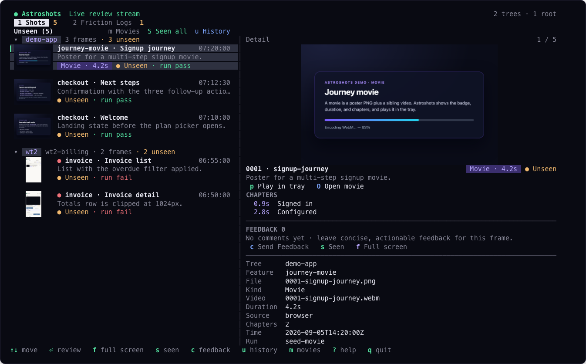
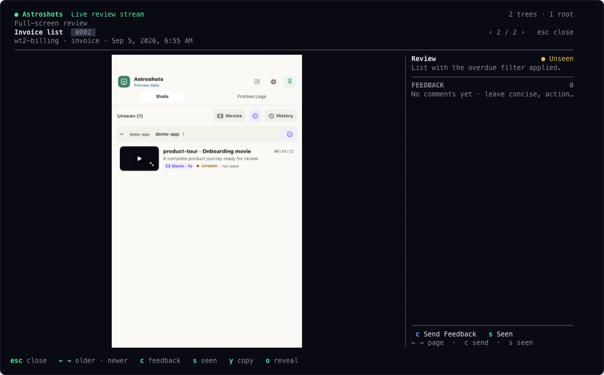

# The terminal tray: `astroshot review`

`astroshot review` is the Astroshots review tray for people who live in a
terminal. It reads the same `.astroshot/` trees and writes the same
`review.json` as the macOS menu-bar app, so both surfaces show one stream and
one set of Seen state and feedback.

```bash
npx astroshot review                 # the folders the Astroshots app watches
npx astroshot review ~/projects      # explicit roots (repeatable, or --root)
npx astroshot review --no-graphics   # text only
```

<p align="center">
  
</p>
<p align="center">
  
</p>

---

## Where pictures render

The tray always shows pictures; the fidelity depends on the terminal.

| Environment | What you get |
|-------------|--------------|
| **Kitty graphics protocol** — Ghostty, kitty, WezTerm, directly attached | Pixel-perfect images and in-tray movie playback |
| **Anything else with truecolor** — plain xterm-256color, and crucially **mosh, tmux, or herdr** | Truecolor **half-block** rendering: each picture is drawn as colored text (two pixels per character), so it survives transports that strip pixel graphics. Movies show their poster; `O` opens the file. |
| No truecolor, or not a TTY | Labeled placeholders, everything else works |

The tray detects mosh, tmux, and herdr and goes straight to half-block text,
because those emulate the terminal themselves and never forward another
program's pixel escapes. To force a mode: `ASTROSHOT_REVIEW_GRAPHICS=kitty`,
`=halfblocks`, or `=none`. Settings (`,`) shows which mode is active and why.

For pixel-perfect images and movie playback, attach a Kitty-capable terminal
directly — not through mosh or a multiplexer.

## Requirements

| Need | Why |
|------|-----|
| A truecolor terminal | Half-block rendering needs 24-bit color (`COLORTERM=truecolor` or an `xterm-256color`-class `TERM`). |
| A **Kitty graphics** terminal, attached directly | Only needed for pixel-perfect images and in-tray movie playback. |
| **ffmpeg** on `PATH` (`brew install ffmpeg`) | In-tray movie playback (Kitty mode). Without it, `O` opens the file in your default player. |
| Node.js 22.14+ | Same as the capture CLI. |

---

## What maps to what

| macOS app | Terminal tray |
|-----------|---------------|
| Menu-bar tray, 430×640 | Full-screen alternate screen. Wide terminals (≥120 columns) split into stream + detail; narrow ones drill in like the app. |
| Shots · Friction Logs tabs | `1` / `2` (or `tab`), with the same amber unseen counts |
| Unseen / History chip, Movies chip, Seen-all | `u`, `m`, `S` (whole visible pool) or `A` (this worktree group) |
| Worktree groups | Contiguous groups with the same chips; `z` collapses one |
| Row text → Detail, thumbnail → full-screen review | `⏎` opens detail (narrow) or full-screen review (split); `f` always opens full screen |
| Detail ← → over the whole stream, newest first | Same: `←` older, `→` newer, `N / M` is the stream position |
| Full-screen ← → over run siblings, oldest → newest | Same, `N / M` is the position within the run |
| Send Feedback, Seen | `c` then type and `⏎`; `s`. Seen in detail returns to the stream; Seen in full-screen closes it. |
| Play in tray / Open movie / chapters | `p`, `O`, and `space` play/pause, `,` `.` seek 5 s, `[` `]` previous/next chapter with markers on the progress bar |
| Copy Image, Show in Finder | `y`, `o` |
| Desktop overlay for new frames | New captures insert at the top with a `N new` badge and a 5.5 s toast while the tray is open |
| Friction log list, run picker, improve rollup, steps, step detail, step takeover | Same screens: `⏎` opens, `[` `]` switch runs (and images inside a step), `p` toggles the prompt, `← →` step, `f` full screen |
| Settings | `,` shows watched folders, graphics capability, ffmpeg, and the index location |

Not carried over: hiding friction logs, narrated video, software updates, and
the desktop overlay window itself.

Press `?` inside the tray for the full key map.

---

## Review contract

The tray is a second writer of the on-disk contract, never a second contract:

- `s` writes `decision: "seen"`, `reviewed_at`, and the current `image_sha256`,
  with the same sorted keys, second-precision UTC timestamps, and uppercase UUID
  comment ids as the app.
- `c` appends a comment without inventing a decision.
- A run-id change resets the review map on the next write, exactly like the
  app's `resetReviewsIfNeeded`.
- Friction logs are acknowledged per run through `runs/<run>/review.json`,
  keyed by `log.jsonl`.
- Seen is never toggled off; replacing an image or starting a new run makes it
  unseen again, and the stale banner says so.

---

## Discovery and performance

- Roots come from `--root` / positional folders, else from the Astroshots app
  preferences on macOS (the same `watchRoots` contract `astroshot doctor`
  reads), else the current directory.
- A durable index under `~/.cache/astroshot-review/index.json` (or
  `$XDG_CACHE_HOME`) remembers known trees, the newest-first arrival order, and
  image hashes, so the tray opens instantly. Every start re-verifies known
  trees, runs a shallow walk (three levels) for new repositories, and only runs
  the deep walk (ten levels, the app's skip list) when the index is older than
  30 minutes. `r` forces a deep rescan.
- Filesystem changes stream in live: images ingest individually, `manifest.json`
  / `review.json` refresh their feature, friction-log paths refresh that
  namespace, and new `.astroshot` directories join the stream.
- Pictures are decoded and downsampled on worker threads and cached by file
  identity and target size. Only frames with a review entry are hashed.

---

## Environment variables

| Variable | Effect |
|----------|--------|
| `ASTROSHOT_REVIEW_GRAPHICS=kitty` / `halfblocks` / `none` | Skip the terminal probe and force the image mode |
| `ASTROSHOT_REVIEW_CELL_PX=9x20` | Override the reported cell size in pixels |
| `ASTROSHOT_REVIEW_CACHE_DIR` | Where the index lives (tests use a temp dir) |
| `ASTROSHOT_REVIEW_FFMPEG` | Path to the ffmpeg binary |
| `ASTROSHOT_REVIEW_DEBUG=1` | Append diagnostics to `./astroshot-review.log` |

---

## Screenshotting the tray

`astroshot pty` fixtures accept `graphics: kitty`. The capture harness then
answers the graphics query and cell-size reports, records every transmitted
image and placement, and paints them into the PNG — which is how the images in
this page were produced, and how the review package's own e2e tests see what a
reviewer sees.
