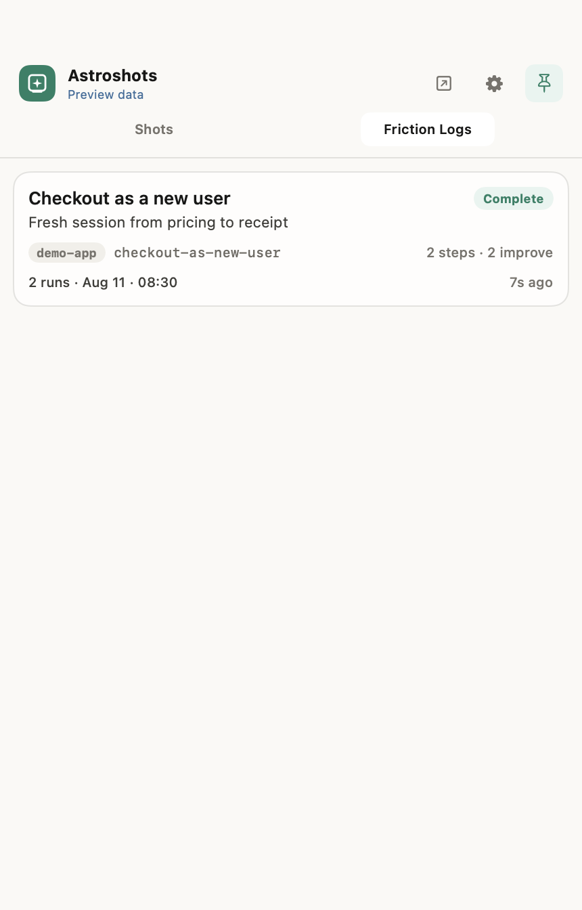
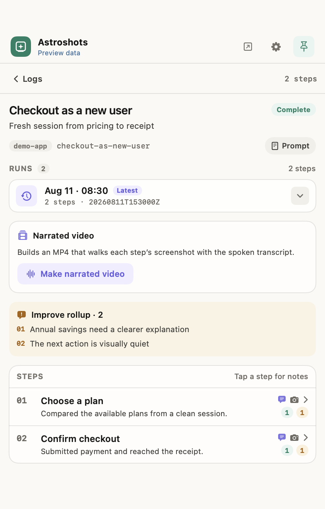
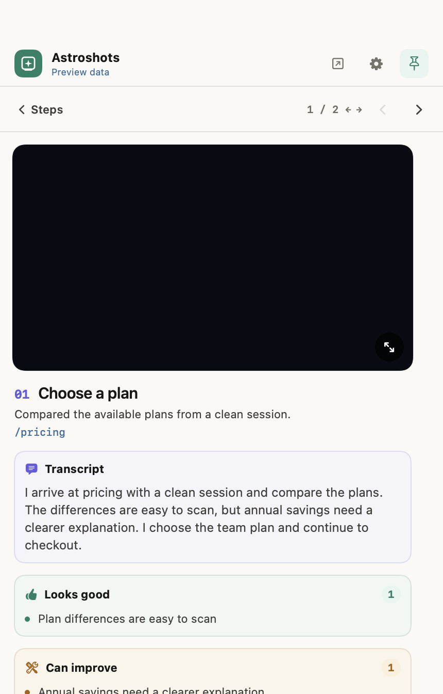

# User stories

A user story is a user-perspective walkthrough of your product: ordered steps,
visual evidence, a spoken transcript, and what was good or should improve. The
tray reads them from a reserved namespace under `.astroshot/`.

User stories were previously called friction logs. The file formats did not
change. New stories are written under `.astroshot/stories/`; the old
`.astroshot/friction-logs/` tree is still read, and existing content there is
never moved or deleted.

---

## Layout

`stories` and `friction-logs` are reserved names, not Shots features; neither
appears in the Shots stream. Readers list both trees, and a slug present in both
is taken from `stories/`. Scenario prompts and every non-empty attempt stay
together:

```text
<project>/.astroshot/stories/checkout-as-new-user/
  prompt.md
  meta.json
  runs/20260811T153000Z/
    log.jsonl
    0001-choose-plan.png
    0002-confirm-checkout.png
  runs/20260810T180000Z/
    log.jsonl
    0001-choose-plan.png
```

---

## Step schema (`log.jsonl`)

Each line is one user-visible step:

```json
{
  "step": 1,
  "id": "choose-plan",
  "title": "Choose a plan",
  "description": "Compared plans from a clean session.",
  "transcript": "I arrive at pricing and compare the plans. The differences are easy to scan, but annual savings need a clearer explanation. I choose the team plan and continue to checkout.",
  "screenshots": ["0001-choose-plan.png"],
  "good": ["Plan differences are easy to scan"],
  "improve": ["Annual savings need a clearer explanation"],
  "url": "/pricing"
}
```

New runs require a short spoken `transcript` per step. Read all transcripts in
order and they should form one continuous narration: action taken, what worked,
what did not, and a transition into the next step.

---

## How the tray reads it

The terminal tray (`astroshot review`) will label this tab `User stories`. The
macOS app, and the screenshots below, may still say Friction Logs until the app is
updated.

- Lists stories from `stories/` and `friction-logs/`.
- Loads every non-empty run **newest-first** and hides empty stubs.
- Rolls up all `improve` notes into a per-run improvement list.
- Lets the reviewer switch runs and step through evidence with ← →.
- Pairs each step's screenshots with its transcript, **Looks good**, and
  **Can improve** notes.

<p align="center">
  
  &nbsp;
  
  &nbsp;
  
</p>

---

## Narrated video (optional)

On Apple Silicon, enable Settings → Narration to generate an on-device MP4 from
step screenshots and transcripts with Qwen3-TTS. Models download only after
opt-in. Astroshots derives the video **after** the run; agents still write the
screenshots and transcripts, never TTS output.

---

## Authoring

Install and use the **user-story** skill to author, list, or execute this
contract — see [`docs/skills.md`](skills.md).

When `archdev shots` is available and enabled (`archdev shots doctor` exits 0),
the same operations are commands:

| Command | Effect |
|---|---|
| `archdev shots stories new <slug> --title <t>` | Create a story |
| `archdev shots stories list [--json]` | List stories |
| `archdev shots stories show <slug> [--run <id>] [--json]` | Show a story and its runs |
| `archdev shots stories run-dir <slug>` | Create and print a new `runs/<run-id>/` directory |
| `archdev shots stories upload <slug>` | Upload a story for review in the ArchCode web UI |
